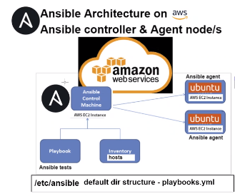

## Ansible - Configuration Management

Ansible and configuration management is responsible for being able to ping instances and install what ever packages you specify on them.

We are going to be doing this using AWS EC2 instances on Ubuntu 18.04. I am doing this because it will automate the process of having to install packages on my instances manually. Imagine if you had to SSH into 200 instances to run an update and upgrade command, well Ansible can automate that process for you.

Benefits of Ansible:
* Open source
* Powerful
* Simple yaml human readable
* Agentless



I am going to need to create one instance for the Ansible controller to be installed on and two more instances which will act as agent nodes.

For the controller to ping these instances I am going to need to make sure it has SSH access and that the ports on the agent nodes allow incoming SSH port 22 connections. I am also going to need to submit the IP addresses so that the controller knows what instance to ping.

On the controller I can create playbooks.yml that will tell it what packages to install. and 

The host file (inventory) is located here etc/ansible/ (default location). I have to run the playbooks from this directory.

Create 3 instances

* tech258-lewis-ansible-controller SG SSH 22
* tech258-lewis-ansible-app SG SSH 22, HTTP 80, Node 3000
* tech258-lewis-ansible-db SG SSH 22, Mongodb 27017

SSH into all 3 instances and run

```
sudo apt-get update
sudo apt-get upgrade -y
```

You can just do this for the controller and use the below command to update and upgrade them from it later once Ansible has been installed and the connection to the instances in the hosts file has been made.

Update all connected nodes specified in the hosts file

```
sudo ansible all -a "sudo apt-get update -y"
sudo ansible all -a "sudo apt-get upgrade -y"
```

On the controller you can run the below command to install any packages that could be missing

```
sudo apt-get install software-properties-common
```

Download everything you need to install ansible

```
sudo apt-add-repository ppa:ansible/ansible
```

Run an update incase anything missing

```
sudo apt-get update
```

Install ansible

```
sudo apt-get install ansible -y
```

To see the installed version of ansible

```
sudo ansible --version
```

Always navigate to the below directory before running ansible commands/playbooks

```
cd /etc/ansible
```

SCP my SSH key into the controller 

```
scp -i ~/.ssh/tech258.pem ~/.ssh/tech258.pem ubuntu@34.255.193.7:~/.ssh/
```

:boom: Give read permissions to the private key or it will get locked

```
cd ~/.ssh
sudo chmod 400 "tech258.pem"

# ll to check permissions
```

Connect now to the app through the ansible controller instance using the connect on aws as I would usually do.

Then use the command below to return to the controller.

```
exit
```

Repeat this for the database.

Now we need to sudo nano into the hosts file and add the two lines below.

```
sudo nano hosts
```

```
# app ansible_host=34.253.207.240 ansible_user=ubuntu ansible_ssh_private_key_file=~/.ssh/tech258.pem ansible_port=22

# database ansible_host=52.213.36.231 ansible_user=ubuntu ansible_ssh_private_key_file=~/.ssh/tech258.pem ansible_port=22

[web]
ec2-instance-app ansible_host=3.252.65.152 ansible_user=ubuntu ansible_ssh_private_key_file=~/.ssh/shahrukh-devops.pem

[db]
ec2-instance-database ansible_host=3.252.65.152 ansible_user=ubuntu ansible_ssh_private_key_file=~/.ssh/shahrukh-devops.pem
```

To ping all specified in the hosts file you can do the below command. This in industry would be the regions that you're pinging.

```
sudo ansible all -m ping
```

### Adhoc Commands and Extras

https://docs.ansible.com/ansible/latest/command_guide/intro_adhoc.html

You can install tree 

```
sudo apt-get install tree -y
```

Use tree to show file paths in with a nicer layout

```
tree
```

check specs etc such as ip os running (didn't need to install any ansible packages - agentless)

```
sudo ansible web -a "uname -a"
```

Check how much memory is free on one of your nodes

```
sudo ansible web -a "free"
```

Check the date and time on one of your nodes.

```
sudo ansible web -a "date"
```

Update all connected nodes specified in the hosts file

```
sudo ansible all -a "sudo apt-get update -y"
```

Check what files are on the web instance

```
sudo ansible web -a "ls -a"
sudo ansible web -a "ls"
```

Copy a file from the controller over to one of the nodes. Here I'm referencing the path of the test file and where I want it to go on the web node.

```
sudo ansible web -m copy -a "src=/home/ubuntu/testing-controller.txt dest=/home/ubuntu"
```

### Creating a Playbook to Install Nginx

Use the below command to start creating the playbook.

```
sudo nano nginx-playbook.yml
```

```
# creating a playbook to install/configure nginx in the web server
---
# YAML starts with three dashes
 
# add the name of the host web
- hosts: web
 
# see the logs gather facts
  gather_facts: yes
 
# provide admin access - sudo
  become: true
 
# add instructions to install nginx on the web server
  tasks:
  - name: Installing Nginx web server
    apt: pkg=nginx state=present
# ensure to nginx is in a running state
```

Run the play book

```
sudo ansible-playbook nginx-playbook.yml
```

Check nginx is running

```
sudo ansible web -a "sudo systemctl status nginx"
```

### Whole script

Create the file with the below command

```
sudo nano app-playbook.yml
```

Paste the below script to get the app running can check the public IP with :3000 on the end to see if it was successful.

```
---
# YAML starts with three dashes

# add the name of the host web
- hosts: web

# see the logs gather facts
  gather_facts: yes

# provide admin access - sudo
  become: true

# add instructions to install nginx on the web server
  tasks:
     - name: Installing Nginx web server
       apt: pkg=nginx state=present
# ensure to nginx is in a running state

# install node
     - name: Installing Node.js
       apt:
         name: nodejs
         state: present

  tasks:
    - name: Update and upgrade apt packages
      apt:
        upgrade: yes
        update_cache: yes
        cache_valid_time: 86400 #One day
 
## install npm
    - name: Installing npm
      apt:
        name: npm
        state: present
 
    - name: download latest npm + Mongoose
      shell: |
        npm install -g npm@latest
        npm install mongoose@ -y
 
## update and upgrade agent node
  tasks:
  - name: Update and upgrade apt packages
    apt:
      upgrade: yes
      update_cache: yes
      cache_valid_time: 86400 #One day
 
## clone app

  - name: clone app github repository
    git:
      repo: https://github.com/LewisTowart/tech258-lewis-cicd-app
      dest: /tech258-lewis-cicd-app
      clone: yes
      update: yes
## install pm2
  - name: install pm2
    shell: |
      cd /tech258-lewis-cicd-app/app
      npm install -y
      npm install pm2@4.0.0 -g
 
## launch app with pm2
  - name: launch app with pm2
    shell: |
      cd /tech258-lewis-cicd-app/app
      pm2 kill
      pm2 start app.js
```

Run the newly created playbook with the below command.

```
sudo ansible-playbook app-playbook.yml
```

### Database playbook

---
- hosts: db

  gather_facts: yes

  become: true

# install mongodb

  tasks:
  - name: install and configure mongodb
    apt: pkg=mongodb state=present

# allow required ports 27017 from app
#deleted the default mongo.conf rm -rf /etc/mongod.conf
# create mongod.conf in the controlller - with required config
# Need read permissions
# allow 27017 from app or 0000
  - name: Allow Ports
    lineinfile:
      path: /etc/mongodb.conf
      regexp: '^ *bind_ip *=.*$'
      line: 'bind_ip = 0.0.0.0'
      backrefs: yes
# restart mongodb
# enable mongodb
  - name: Restart and Enable
    systemd:
      name: mongodb
      state: restarted
      enabled: yes
# create an env DB_HOST=db-ip:27017/posts
# back to web server restart the app/pm2 start

# echo "DB_HOST=mongodb://172.31.40.174:27017/posts" | sudo tee -a /etc/environment >/dev/null

# source /etc/environment

# curl -fsSL https://deb.nodesource.com/setup_17.x | sudo -E bash -
# sudo apt install nodejs

# sudo npm install mongoose@4.09

# export DB_HOST=mongodb://10.0.3.4:27017/posts 


