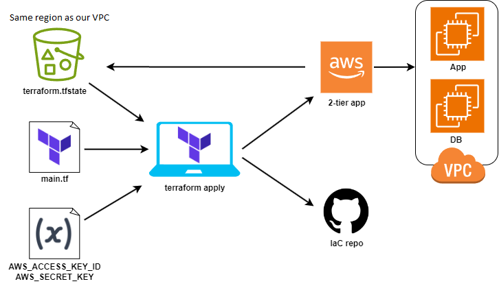

- [Terraform - Orchestration](#terraform---orchestration)
  - [States](#states)
- [Introduction](#introduction)
- [Project Architecture](#project-architecture)
  - [Installing Terraform](#installing-terraform)
  - [Setting Up Terraform](#setting-up-terraform)
  - [Variables](#variables)
  - [Git Ignore](#git-ignore)
- [Using Terraform to Create a VPC](#using-terraform-to-create-a-vpc)
    - [Creating the App Instance](#creating-the-app-instance)
    - [Creating the App Instance in the VPC with two subnets](#creating-the-app-instance-in-the-vpc-with-two-subnets)
    - [Creating the DB instance](#creating-the-db-instance)
    - [Security group for the DB](#security-group-for-the-db)
    - [Creating a Repo on Github](#creating-a-repo-on-github)
- [Using S3 with terraform.tfstate](#using-s3-with-terraformtfstate)


## Terraform - Orchestration

Terraform is an open-source tool developed by HashiCorp that lets you manage and provision your infrastructure using code. By writing simple configuration files, you can describe the resources you need, like servers, databases, and networking components. Terraform then takes care of creating, updating, and deleting these resources to match your configurations. It supports many cloud providers, such as AWS, Azure, and Google Cloud, allowing you to automate your infrastructure easily. This helps ensure consistency and reduces the potential for human error when managing complex environments.

Terraform in some companies is a requirement due to multi-cloud deployment. Terraform can work across all cloud providers unlike some tools that are locked to their specific provider. From my time in recruitment I can concur the amount of companies looking for skills within Terraform specifically are plentiful. Terraform is locally available communicating with the cloud.

You can build infrastructure in the cloud on ansible but it is 5x the work if you compare the scripts next to each other the one for Ansible will be much longer.

Benefits:
* Open source
* Isn't locked to one cloud provider (Multi-cloud deployment)
* Very powerful
* Automation

### States

Desired State:
This is the configuration you define in your Terraform files (e.g., main.tf). It represents what you want your infrastructure to look like.

Current State:
This is the actual state of your infrastructure at any given moment. Terraform keeps track of this state in a state file (e.g., terraform.tfstate).

To put this into perspective if you have an instance running on AWS and used the portal to change it's name. This is the current state which is now different to the desired state which is how you set the instance up originally in the main.tf. If you try to run a terraform plan it will act as a form of version control and say something had been changed within the current state.

As for the desired state if you had an instance deployed called instance_1 and then went back to the main.tf and changed the name to instance_2 the desired state would now be ahead/different to the current state. This is referred to as desired as it is how you want the current state of the instance to be but not in fact what the current state actually is it would still be named instance_1 until you run terraform plan and apply.

## Introduction

Before starting be warned:
* :boom: AWS_ACCESS_KEY_ID: DO NOT HARDCODE THE KEY IN TERRAFORM :boom:
* :boom: AWS_SECRET_ACCESS_KEY: DO NOT HARDCODE THE KEY IN TERRAFORM :boom:
* :boom: DO NOT PUSH ANYTHING TO GITHUB UNTIL WE HAVE CREATED A .gitignore file :boom:
* :boom: .gitignore NEEDS TO INCLUDE THE terraform.tfstate, terraform.tfstate.backup, variables.tf, .terrform/ and terraform.lock.hcl FILES. :boom:


## Project Architecture



### Installing Terraform

To install Terraform follow the below link.

https://developer.hashicorp.com/terraform/install

Here you can install the correct version for me it was windows amd64 which is version 18.3.

You can now create a folder and unzip this file there. Run the terraform.exe and search in you local windows for environment variable. Select the option that says "Edit the system environment variables".

From there at the bottom you will see environment variables click that option. Next we want to select on the user variable the one that states path. Now click the edit option. Next we want to add a new line and give it the path to where you have installed Terraform in my case it was the below path.

C:\terraform

Once Terraform is installed you can do the below command in your bash terminal to check the version

```
terraform -v
```

Before we begin it is important to note you can use the below command to see all of the other commands and information associated with Terraform.

```
Terraform
```

### Setting Up Terraform

We now need to provide our AWS keys to Terraform so that it has access when we go to create an VM.

To do this you need environment variables set on our local host for Terraform to access AWS. You do this by searching for environment variable on you local device and selecting the option that says "Edit the system environment variables".

From there at the bottom you will see environment variables click that option. Next we want to add a new system environment variable for the below two keys. I have stored these keys in my .ssh folder for future reference. The title is as below and the actually value to put in is the key.

AWS_ACCESS_KEY_ID
AWS_SECRET_ACCESS_KEY

Navigate to the area I am working with terraform in my case my C:\Users\lewis\Desktop\Sparta_Global\Tech_258\github\IaC\Orchestration-with-Terraform

### Variables

:boom: Add the variables.tf to your .gitignore file :boom:

Before moving onto the next section it is important to note that you can create a variables.tf. Within this file you can specify different variables that you will seeing me calling upon in the scripts below. This is a great way to hide information you may not want people seeing.

Here is an example of a variable.

```
variable "ami_id" {
  

  default = "YOUR-AMI-ID"
}
```

### Git Ignore

Before doing anything make sure that once Terraform has been set up you create a .gitignore file somewhere in the local repo you are working with Terraform in. You need to add the following files to it as it will prevent any data leaks which can be devastating.

.terraform/
.terraform.lock.hcl
terraform.tfstate
terraform.tfstate.backup
variable.tf

## Using Terraform to Create a VPC

:boom: It is important to note with Terraform you are going to want to launch your VS code where you are editing your Terraform script and if you're using a separate bash terminal this will also need to be run as administrator. :boom:

In the terminal create a new main file using the below command.

```
nano main.tf
```

Terraform is written in HCL Hashicorp Language as they are who initially created terraform.

We need to initiate a script to download the dependencies relevant to the cloud provider/s we're working with.

Enter the below code into the script and save it. This code states the provider we are working with so when we perform the next command Terraform will know which dependencies we need.

```
provider "aws"{

        region = "eu-west-1"
}
```

Now in the bash terminal we want to run the below command which will download and install the dependencies needed.

```
terraform init
```

#### Creating the App Instance

Below is the code for launching the instance for the app. This need to be pasted/written in the main.tf script file.

```
# create a service on the cloud - launch a ec2 instance on aws
# HCL syntax key = value

# which part of AWS - which region

provider "aws"{

        region = "eu-west-1"
}
# aws-access-key-id = the key DO NOT HARDCODE
# aws-secret-access-key = the key DO NOT HARDCODE
# MUST NOT PUSH TO GITHUB UNTIL WE HAVE CREATED A .gitignore file together
# which service/resource/s - ec2
resource "aws_instance" "app_instance" {

# which type of instance - ami to use
       ami = "ami-02f0341ac93c96375"

# t2micro
       instance_type = "t2.micro"

# associate public ip with this instance
        associate_public_ip_address = true

# name  the ec2/resource
        tags = {
             Name = "lewis-terraform-tech258-app"
      }
}
```

We can now run the plan before we execute which will compile the script looking for any syntax errors or missing dependencies.

```
terraform plan
```

We are now going to run terraform apply which will actually run the script and launch our instance one AWS as we have specified in the script.

```
terraform apply
```

My instance will now be running, if we want to terminate the instance we could use the below command.

```
terraform destroy
```

#### Creating the App Instance in the VPC with two subnets

This script will create a VPC with two subnets one for the App and one for the Database. It will also launch the App in the App subnet and apply the security group I have outline.

```
# create a service on the cloud - launch a ec2 instance on aws
# HCL syntax key = value

# which part of AWS - which region

provider "aws"{

        region = var.sparta_region
}
# aws-access-key-id = the key DO NOT HARDCODE
# aws-secret-access-key = the key DO NOT HARDCODE
# MUST NOT PUSH TO GITHUB UNTIL WE HAVE CREATED A .gitignore file together
# which service/resource/s - ec2
resource "aws_vpc" "vpc" {
  cidr_block = var.vpc_ip
  
  tags = {
    Name = "lewis_terraform_vpc"
  }
}
resource "aws_security_group" "app_security_group" {
  vpc_id      = aws_vpc.vpc.id 
  name        = "lewis-terraform-app-security-group"
  description = "Allow SSH, HTTP, and Node inbound traffic"
  ingress {
    from_port   = 22
    to_port     = 22
    protocol    = "tcp"
    cidr_blocks = var.ip_access
  }
  ingress {
    from_port   = 80
    to_port     = 80
    protocol    = "tcp"
    cidr_blocks = var.ip_access
  }
  ingress {
    from_port   = 3000
    to_port     = 3000
    protocol    = "tcp"
    cidr_blocks = var.ip_access
  }
  egress {
    from_port   = 0
    to_port     = 0
    protocol    = "-1"
    cidr_blocks = var.ip_access
  }
}
resource "aws_subnet" "app_subnet" {
  vpc_id = aws_vpc.vpc.id
  cidr_block = var.app_subnet_ip
  availability_zone = var.az_one

  tags = {
    Name = "lewis_subnet_app"
  }
}

resource "aws_subnet" "db_subnet" {
  vpc_id = aws_vpc.vpc.id
  cidr_block = var.db_subnet_ip
  availability_zone = var.az_two

  tags = {
    Name = "lewis_subnet_db"
  }
}
resource "aws_instance" "app_instance" {

# which type of instance - ami to use
       ami = var.ami_id
       

# t2micro
       instance_type = var.instance_type_used

# app_subnet
       subnet_id = aws_subnet.app_subnet.id

# associate out key
       key_name = var.my_key_name

# SG group
       vpc_security_group_ids = [aws_security_group.app_security_group.id]

# associate public ip with this instance
        associate_public_ip_address = true

# name  the ec2/resource
        tags = {
             Name = "lewis-terraform-tech258-app"
      }
}
```
#### Creating the DB instance

```
resource "aws_instance" "db_instance" {

# which type of instance - ami to use
       ami = var.sparta_region

# t2micro
       instance_type = var.instance_type_used

# app_subnet
       subnet_id = aws_subnet.db_subnet.id

# associate out key
       key_name = var.my_key_name

# SG group
       vpc_security_group_ids = [aws_security_group.db_security_group.id]

# associate public ip with this instance
        associate_public_ip_address = true

# name  the ec2/resource
        tags = {
             Name = "lewis-terraform-tech258-db"
      }
}
```
#### Security group for the DB

```
resource "aws_security_group" "db_security_group" {
  vpc_id      = aws_vpc.vpc.id 
  name        = "lewis-terraform-db-security-group"
  description = "Allow SSH and Mongo inbound traffic"
  ingress {
    from_port   = 22
    to_port     = 22
    protocol    = "tcp"
    cidr_blocks = var.ip_access
  }
  ingress {
    from_port   = 27017
    to_port     = 27017
    protocol    = "tcp"
    cidr_blocks = var.ip_access
  }
  egress {
    from_port   = 0
    to_port     = 0
    protocol    = "-1"
    cidr_blocks = var.ip_access
  }
}
```

#### Creating a Repo on Github

In this script I am providing terraform with the token I generated from going into my GitHub account settings, using develop settings right at the bottom, clicking personal access tokens, tokens (classic) and then generate new token (classic). The options I selected were repo and admin:repo_hook. Make sure to select the options you need for what action you are trying to perform.

```
provider "github" {

  token = var.git_token

}
resource "github_repository" "automated_repo" {
  name        = "IaC-github-automated-repo"
  description = "automated terraform repo"
  visibility  = "public"
}
```

Make sure to run the below command when you are working with a new provider to download and install the required dependencies

```
terraform init
```

You can work with multiple providers similar to the script below by referencing which providers will be included within your script and running the terraform init command to get the necessary dependencies.

```
provider "aws"{

        region = var.sparta_region
}
provider "github" {

  token = var.git_token
}
```

## Using S3 with terraform.tfstate

S3 storage can be used for the terraform.tfstate files. This is a great way to add a layer of security and allow them to be shared with other members of the team who will also be working with them. One issue that can arise is that multiple people are working across the state files at the same time without communicating this fact. This is why the state files need to be locked to ensure only one person is making changes at one time. This is automatically done locally but needs to be configured for remote management. 

DynamoDB is a key-value and document database that handles large amounts of data and high request rates, making it ideal for a wide range of applications. By setting up state locking with S3 and DynamoDB, you ensure that your Terraform state is managed safely and consistently, allowing multiple users to collaborate without conflict. A single DynamoDB table can be used to lock multiple remote state files. While creating a S3 bucket and DynamoDB table are necessary you also need to set up the backend to declare that S3 and Dynamo will be used for locking/state management.

How It Works

Initialization:

* Run terraform init to initialize the backend configuration. Terraform will set up the S3 bucket for state storage and the DynamoDB table for state locking.

Acquiring a Lock:

* When you run a Terraform command that modifies the state (e.g., terraform plan or terraform apply), Terraform will attempt to acquire a lock in the DynamoDB table.
* If the lock is acquired successfully, Terraform proceeds with the operation.

Holding the Lock:

* While the Terraform operation is in progress, the lock is held in the DynamoDB table. This prevents other Terraform operations from running concurrently and modifying the state file.

Releasing the Lock:

* Once the operation is complete, Terraform releases the lock from the DynamoDB table, allowing other operations to proceed.

Handling Locking Issues:

* If a Terraform operation is interrupted or fails to release the lock, you can manually remove the lock using the terraform force-unlock command with the lock ID.

Region Requirement:

* The S3 bucket and the resources (such as EC2 instances) accessing it must be in the same AWS region to avoid cross-region data transfer costs and potential latency issues.
* If your S3 bucket is in the eu-west-1 region, your EC2 instances should also be in the eu-west-1 region for optimal performance and cost.


